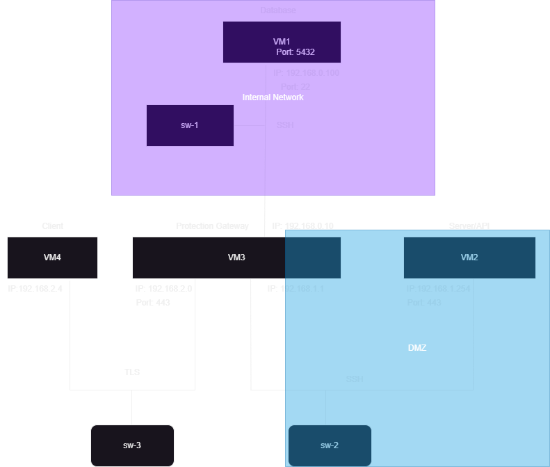
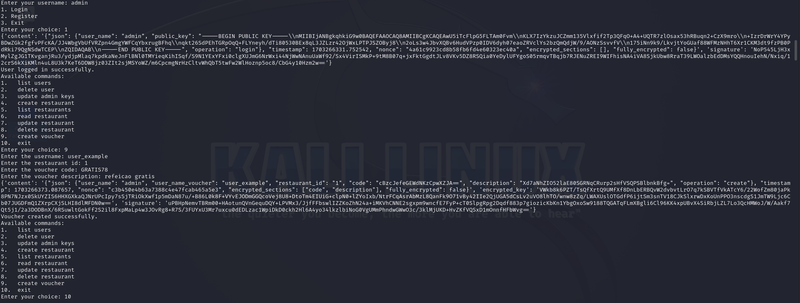
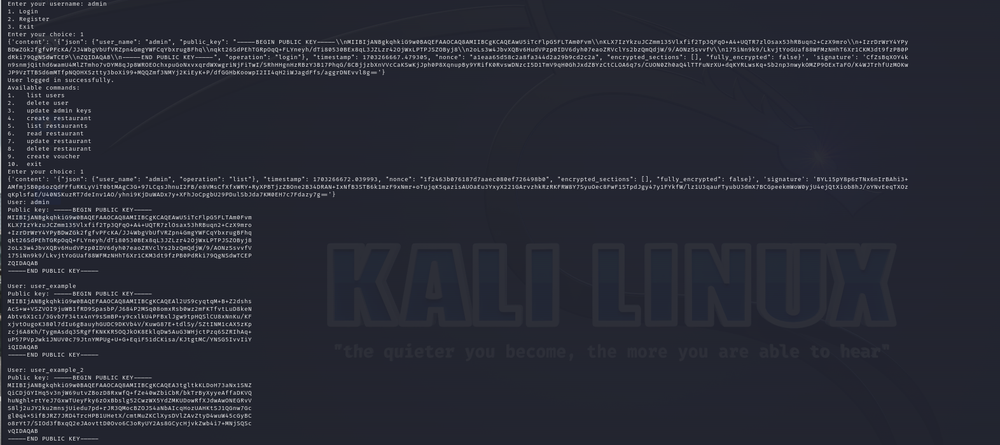
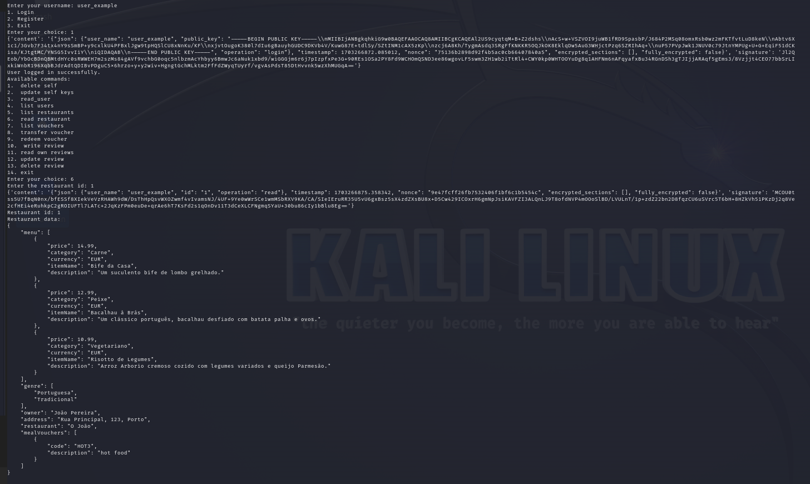
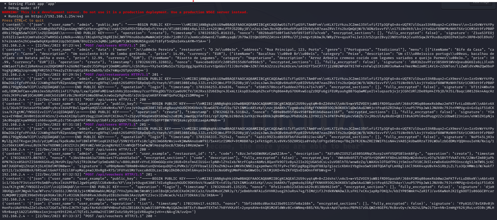
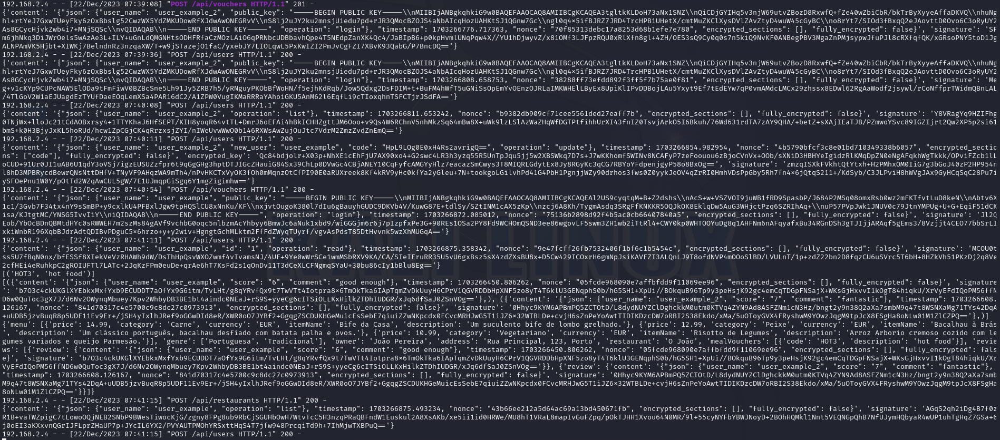
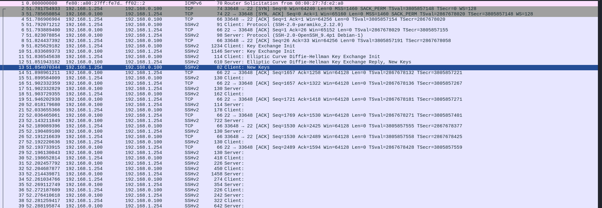

# A35 BombAppetit Project Read Me

<!-- this is an instruction line; after you follow the instruction, delete the corresponding line. Do the same for all instruction lines! -->


## Team

| Number | Name              | User                             | E-mail                              |
| -------|-------------------|----------------------------------| ------------------------------------|
| 99265  | Luís Marques      | https://github.com/Pacten15      | luis.p.marques@tecnico.ulisboa.pt   |
| 99313  | Ramiro Moldes     | https://github.com/marmarmarques | marquesmoldes@tecnico.ulisboa.pt    |


  


## Contents

This repository contains documentation and source code for the *Network and Computer Security (SIRS)* project.

The [REPORT](REPORT.md) document provides a detailed overview of the key technical decisions and various components of the implemented project.
It offers insights into the rationale behind these choices, the project's architecture, and the impact of these decisions on the overall functionality and performance of the system.

This document presents installation and demonstration instructions.


## Installation

To see the project in action, it is necessary to setup a virtual environment, with N networks and M machines.  

The following diagram shows the networks and machines:



### Prerequisites

All the virtual machines are based on: Linux 64-bit, Kali 2023.3  

[Download Pre-Made VirtualBox VM](https://cdimage.kali.org/kali-2023.3/kali-linux-2023.3-virtualbox-amd64.7z) and [install](https://download.virtualbox.org/virtualbox/7.0.12/VirtualBox-7.0.12-159484-Win.exe) a virtual machine running on windows of Kali Linux 2023.3. and instructions to install kali linux on a virtual box [instructions](https://www.kali.org/docs/virtualization/import-premade-virtualbox/)
Clone the base machine to create the other machines.


### Machine configurations

For each machine, there is an initialization script inside of a folder with the machine name, with name `config_execute.sh` , that installs all the necessary packages and makes all required configurations in the a clean machine, if the file is not executable do `chmod +x config_execute.sh`.

Inside each machine, use Git to obtain a copy of all the scripts and code.

```sh
$ git clone https://github.com/tecnico-sec/a35-luis-ramiro
```

To run all of the commands above it should first configure all the network configuration for each VM, execute the scripts and afterwards turn down all of the machines and run them again.


Next we have custom instructions for each machine.

#### Machine 1 (VM1)

This machine runs the database using postgresSQL 16 and it runs a firewall in this case ufw, the explanation and exemplification of what was sent is in this text file [config.txt](Project/VM1/config.txt)


To verify:

```sh
$ cd Project/VM1
$ ./config_execute.sh
```

To test:

```sh
$ sudo systemctl status postgresql
● postgresql.service - PostgreSQL RDBMS
     Loaded: loaded (/lib/systemd/system/postgresql.service; enabled; preset: disabled)
     Active: active (exited) since Thu 2023-12-21 09:24:51 EST; 1h 36min ago
    Process: 927 ExecStart=/bin/true (code=exited, status=0/SUCCESS)
   Main PID: 927 (code=exited, status=0/SUCCESS)
        CPU: 14ms

(... omitted ...)
```
To verify if the postgres SQL was created correctly, to see if that is the fact it should appear enabled for the service

```sh
$ sudo ufw status verbose
Status: active
Logging: on (low)
Default: deny (incoming), allow (outgoing), disabled (routed)
New profiles: skip

To                         Action      From
--                         ------      ----
192.168.0.100 22           ALLOW IN    ANY
```

To verify if the rules were currectly defined and if ufw is operating
To see if that is the fact it should appear that the virtual machine denies incoming, and disables the route that will deny forwarding and allows outgoing requests 

```sh
$ sudo systemctl status ssh
 ssh.service - OpenBSD Secure Shell server
     Loaded: loaded (/lib/systemd/system/ssh.service; enabled; preset: disabled)
     Active: active (running) since Thu 2023-12-21 09:24:45 EST; 1h 38min ago
     (... omitted ...)

```
To verify if the virtual machine has SSH enabled and working.
It should appear active.

If any of these commands do not show the intended, the possible solutions is rerunning the configuration file already refered.


#### Machine 2 (VM2)

This machine runs the server API, it uses python 3.11.2 and a firewall with ufw, a full explanation is found in [config](Project/VM2/config.txt)

To verify:

```sh
$ cd Project/VM2
$ ./config_execute.sh
```

To test, VM1 and VM3 must be setup, the expected results are show in conjunction:

```sh
$ sudo ufw status verbose
Status: active
Logging: on (low)
Default: deny (incoming), allow (outgoing), disabled (routed)
New profiles: skip

To                         Action      From
--                         ------      ----          
192.168.1.254 443          ALLOW IN    Anywhere 

$ ip a
(... omitted ...)
2: eth0: <BROADCAST,MULTICAST,UP,LOWER_UP> mtu 1500 qdisc fq_codel state UP group default qlen 1000
    link/ether 08:00:27:8f:ab:8b brd ff:ff:ff:ff:ff:ff
    inet 192.168.1.254/24 brd 192.168.1.255 scope global eth0
       valid_lft forever preferred_lft forever
(... omitted ...)

$ ssh 192.168.0.100
kali@192.168.0.100's password:
```

If the ip differs, please reboot the machine.

If ssh halts with no output, it is a connection issue, most likely from VM3 not properly forwarding.

If running the API shows postgres connection refuse.

If running the API shows import error it is possible that pip failed midway.

#### Machine 3 (VM3)

This machine runs the main firewall and is the point of connection to all of the other VM's, using to apply the firewall ufw.

```sh
$ sudo ufw status verbose
Status: active
Logging: on (low)
Default: deny (incoming), allow (outgoing), deny (routed)
New profiles: skip

To                         Action      From
--                         ------      ----
192.168.0.100 22           ALLOW IN    192.168.1.254                        
192.168.1.254 443          ALLOW IN    Anywhere                  

192.168.0.100              ALLOW FWD   192.168.1.254             
192.168.1.254 443          ALLOW FWD   Anywhere
```

To verify if the rules were currectly defined and if ufw is operating
To see if that is the fact it should appear that the virtual machine denies incoming, and disables the route denying forwarding and also should allow outgoing comunication


```sh
$ ssh 192.168.0.100 
```

Verify if the ssh halts, this tests the firewall.


#### Machine 4 (VM4)

This machine runs the client, it uses python 3.11.2, a full explanation is found in [config](Project/VM4/config.txt)

To verify:

```sh
$ cd Project/VM4
$ ./config_execute.sh
```

To test, VM1, VM2, and VM3 must be setup, the expected results are show in conjunction:

```sh
$ ip a
(... omitted ...)
2: eth0: <BROADCAST,MULTICAST,UP,LOWER_UP> mtu 1500 qdisc fq_codel state UP group default qlen 1000
    link/ether 08:00:27:2a:cf:e5 brd ff:ff:ff:ff:ff:ff
    inet 192.168.2.4/24 brd 192.168.2.255 scope global eth0
       valid_lft forever preferred_lft forever
(... omitted ...)

$ ping 192.168.2.0
PING 192.168.2.0 (192.168.2.0) 56(84) bytes of data.
64 bytes from 192.168.2.0: icmp_seq=1 ttl=63 time=1.82 ms

$ ping 192.168.1.254
PING 192.168.1.254 (192.168.1.254) 56(84) bytes of data.
64 bytes from 192.168.1.254: icmp_seq=1 ttl=63 time=1.82 ms

$ curl -k https://192.168.1.254
<!doctype html>
<html lang=en>
<title>404 Not Found</title>
<h1>Not Found</h1>
<p>The requested URL was not found on the server. If you entered the URL manually please check your spelling and try again.</p>

```

If the ip is not on the 192.168.2.0/24 range, please reboot the machine.

If the ping to 192.168.2.0 works but to 192.168.1.254 halts with no output, it is an issue of VM3's forwarding.

If the curl halts but both pings work, the API isn't running on VM2. The 404 not found is intentional and desired. Running without the `-k` flag should exit with self-sign warning

If running the client shows import error it is possible that pip failed midway.


If any machine in this case VM1 or VM2 which have their own firewalls and the server api cannot connect to the database server, it's advisable to disable both ufw firewalls on both machines so at least their comminications can be established.

If the GUI from the VM's fails due to bad rules in the firewall use CTRL ALT F2 at the same time to open the terminal version of kali linux so it can be possible to change the rules of the firewall and fixing them will make the GUI work again when rebooted.

## Demonstration

Now that all the networks and machines are up and running, ...


In VM2:

```sh
$ cd Project/Server
$ python3 app.py
```

In VM4:

```sh
$ cd Project/Client
$ python3 interface.py
```

In VM4

Register an admin and create a restaurant:


Register a User:


Login as Admin and create a Voucher:



Login as user, list voucher:


As user create a review for the restaurant created and read restaurant to see the result:


As user use Voucher:


Read restaurant to see if the voucher was used:


Register new user and write a review:


Login admin and list Users:



As admin create voucher for the new user:


Login new user and list users:


As new user transfer voucher to first user:


Login first user created and see voucher that was transfered:



Reviews that were properly verified and can be seen by both users


In VM2 we can see all of the requests received during the client executions:

Requests made from the register of the admin until list users made by the first user



Requests made from the list vouchers of first user until read restaurant


Requests made from first user to list restaurants until admin creation of voucher for the second user


Requests made from the login of the first user until list of restaurants made by the same user:




In VM3, we can see a small snippet of the connections between VM's:

In sw-1:

Establish SSH connection between VM1 and VM2:



See what type of connections  happen between VM1 and VM2 when creating a user:


In sw-3:

Establish TLS connection between VM4 and VM2:


See what type of connections  happen between VM4 and VM2 when creating a user:


This concludes the demonstration.

## Additional Information

### Links to Used Tools and Libraries

- [Python 3.11.6](https://www.python.org/downloads/release/python-3116/)
- [PyCryptodome](https://pycryptodome.readthedocs.io/en/latest/)
- [Flask](https://flask.palletsprojects.com/en/3.0.x/)
- [UFW](https://help.ubuntu.com/community/UFW#UFW_-_Uncomplicated_Firewall)
- [Requests](https://requests.readthedocs.io/en/latest/)
- [Psycopg](https://www.psycopg.org/docs/)
- [sshtunnel](https://pypi.org/project/sshtunnel/)

### License

This project is licensed under the MIT License - see the [LICENSE.txt](LICENSE.txt) for details.

----
END OF README
